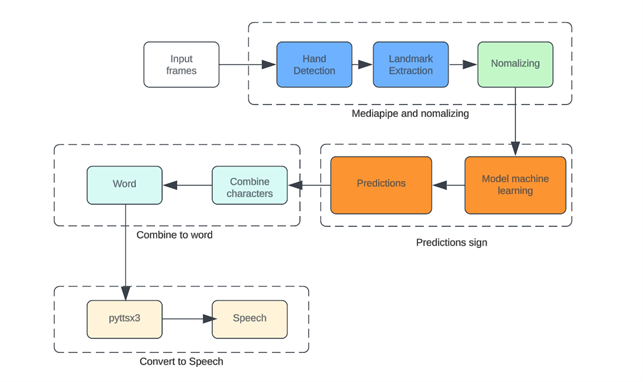
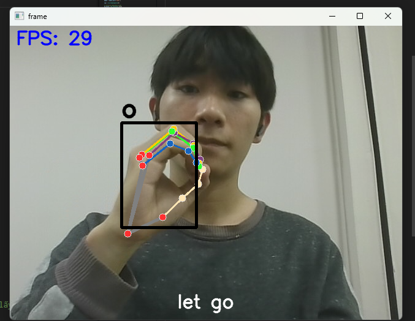

# Project Description
We are developing a lightweight application that enables regular users to communicate with mute individuals without learning sign language. By leveraging MediaPipe and machine learning, the app remains highly efficient and can be deployed on mobile devices. It not only recognizes individual letters but also detects entire words and converts them into speech, making communication more seamless and accessible.

# Workflow

# Data:
We have uploaded a file named data_last.pickle, which contains data processed through the MediaPipe module to extract coordinates.
Additionally, you can access image-based data from the Drive link below:
[Google Drive](https://drive.google.com/drive/folders/1m6wVddUmqHLzm8QCTEk_WS9VEGKR9xxI?usp=sharing)

# Demo
